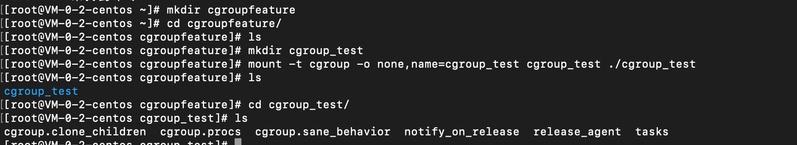
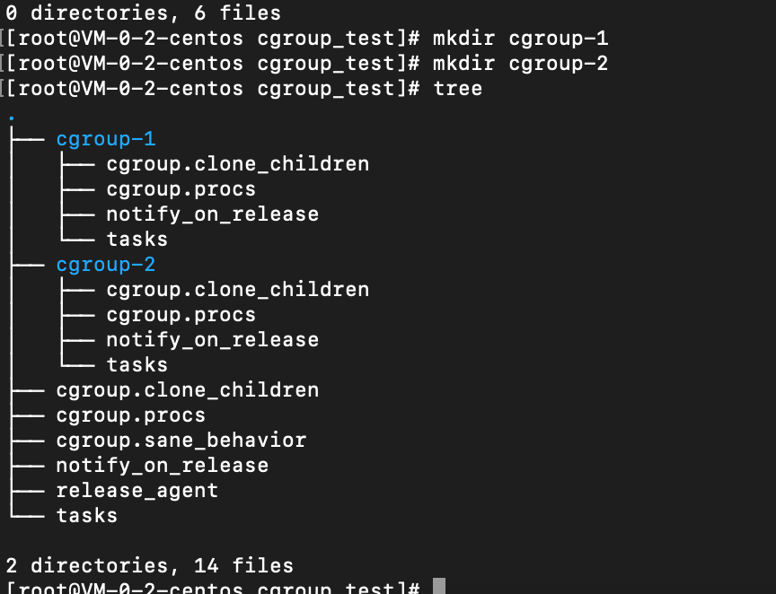
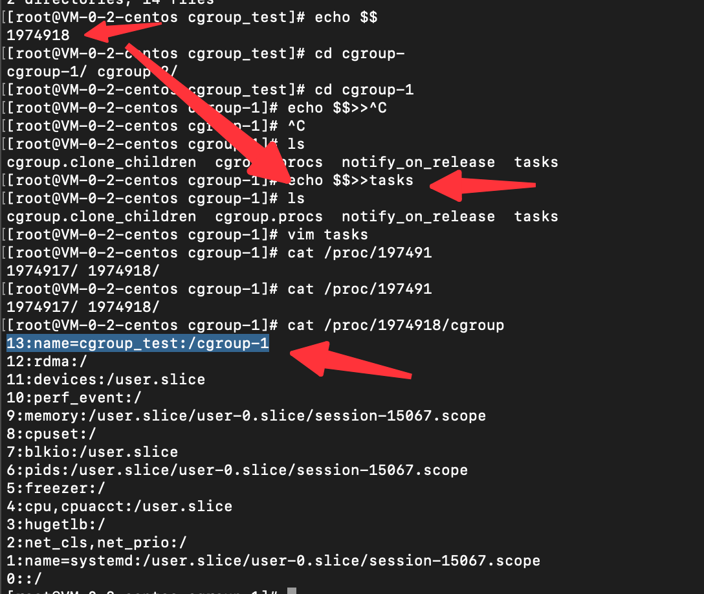
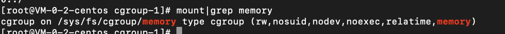

2.linux cgroup
linux cgroups(control groups)提供一组进程和将来子进程的资源限制，控制，统计能力。资源包括cpu，内存，存储，网络等。
方便限制资源占用，实时监控进程和统计信息

cgroup三个组件： 一个cgroup包含一组进程，将一组进程和一组subsystem系统参数关联起来
    1.subsystem是一组资源控制模块，包含：
        blkio:设置对块设备输入输出访问控制
        cpu设置cgroup中进程的cpu被调度策略
        cpuacct统计cgorup中进程占用
        cpuset多核机器上设置cgroup中进程可以使用的cpu和内存(cpu核心还是cpu资源总量？)
        devices控制cgroup中进程对设备的访问
        freezer挂起和恢复cgroup中的进程
        memory控制cgroup中进程的内存占用
        net_cls将cgroup中进程产生的网络包分类，以便linux的tc(traffic controller)根据分类区分出来自某个cgroup的包并进行限流和监控
        net_prio设置cgroup中进程产生的网络流量优先级
        ns使cgroup中进程在新namespace中fork新进程时创建新cgroup

    2.hierarchy功能是把一组cgroup串成一个树状结构，并实现资源限制的继承，防止孙子层资源使用打破上一层的限制

组件关联：
    系统创建新hierarchy，系统所有进程加入这个hierarchy的cgroup根节点(默认创建)
    一个subsystem只能附加到一个hierarchy上
    一个hierarchy可以附加多个subsystem
    一个进程可以作为多个cgroup成员,但这些cgroup必须在不同hierarchy中
    一个进程fork出子进程时,子进程和父进程在同一个cgroup中，也可以根据需要将其移动到其他cgroup中

创建一个文件夹用作挂载点,挂载一个hierarchy,挂载点下生成了一些默认文件
cgroup.clone_children:1则子cgroup继承父cgroup的cpuset配置
cgorup.procs:树中当前节点cgroup中的进程组id，现在在根节点，所以会有现在系统中所有进程组的id
notify_on_release,release_agent:前者表示当前cgroup最后一个进程退出时是否执行release_agent,后者是路径，用作进程退出后自动清理掉不再使用的cgroup
tasks:该cgroup下的进程id，将一个进程id写入tasks文件中，这个进程就加入了这个cgorup中

创建文件夹后,kernel会将其标注为子cgroup，会继承父cgroup的属性
也就是说，在cgroup中创建的所有文件夹会作为新的子cgroup进行标记。

cgroup添加和移动进程:
一个进程在一个cgroup的hierarchy中,只能在一个cgroup节点存在,只需要将进程id写入目标cgroup节点的tasks中即可

echo $$展示当前进程id，将其写入目标cgroup的task中，最后在/procs
该进程id文件夹下查询所属cgroup发现已被加入该cgroup

关联subsystem并限制资源:
系统默认为每个subsystem创建默认hierarchy,例如memory的hierarchy:

/sys/fs/cgroup/memory目录就是挂在memory subsystem的hierarchy上，通过在这个hierarchy创建cgroup限制进程占用内存.
(同一个进程可以存在在不同hierarchy的cgroup中，所以一个进程可以被多个hierarchy挂载，进程a挂载在memory的hierarchy，进程a同时挂载在cpuset的hierarchy，这样就实现了cpu和memory的限制)

创建一个进程,创建cgroup,echo '100m'>memory.limit_in_bytes)限定大小，
然后将进程移动到这个新建的命名空间下:echo $$>tasks

docker如何使用cgroup:
/sys/fs/cgroup/memory/{容器id}/{memory.limit_in_bytes)}